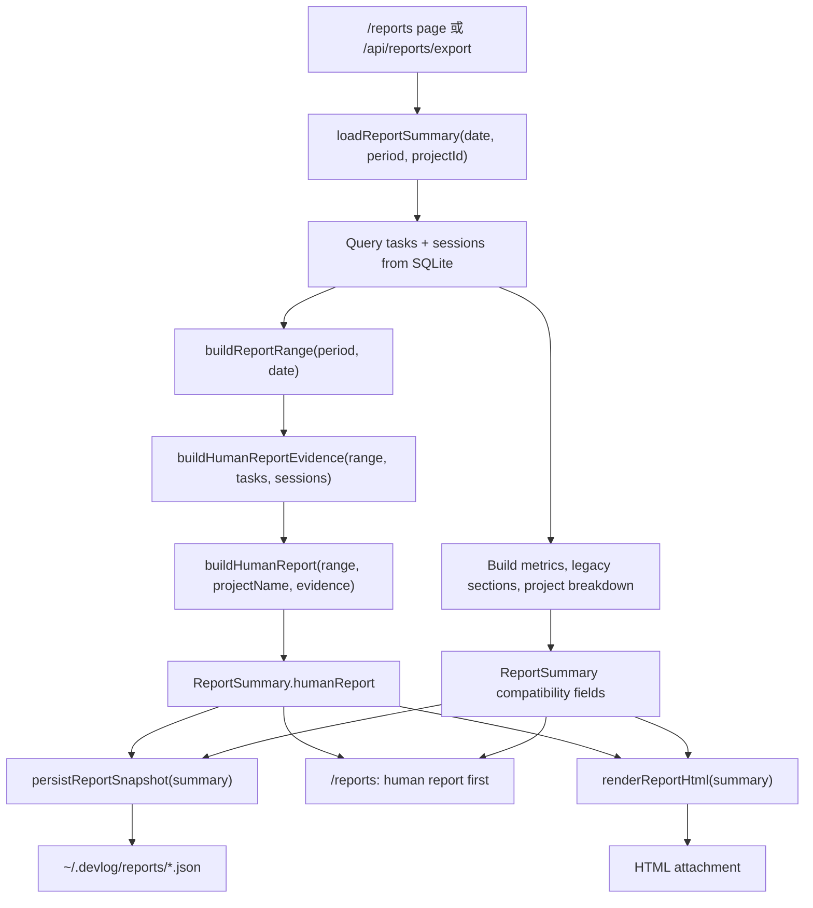
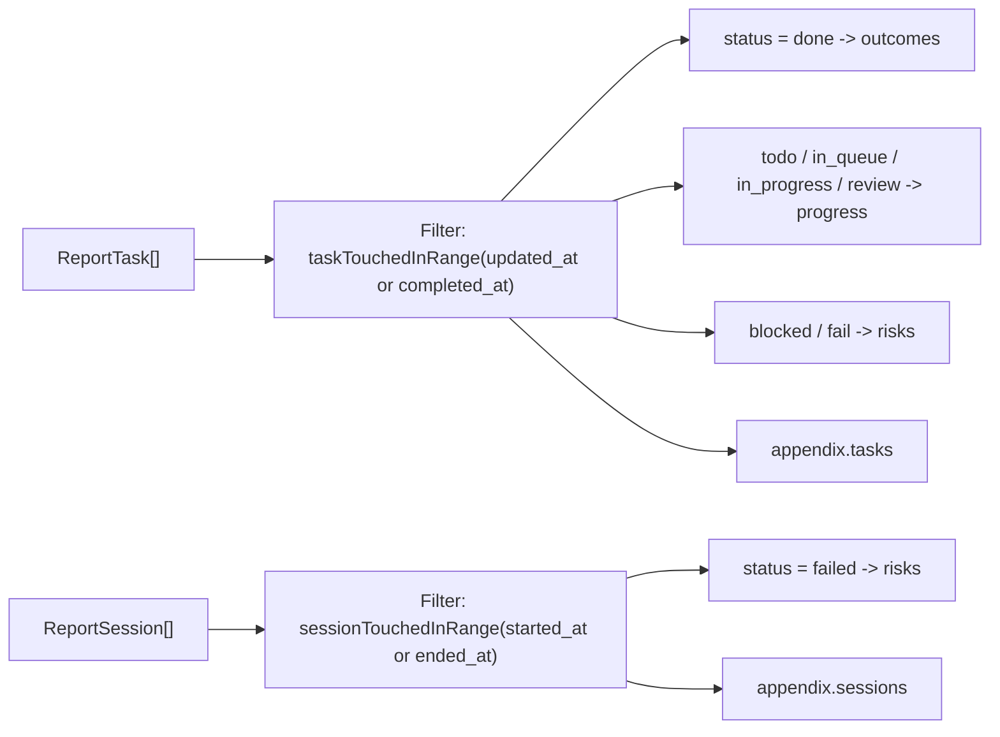
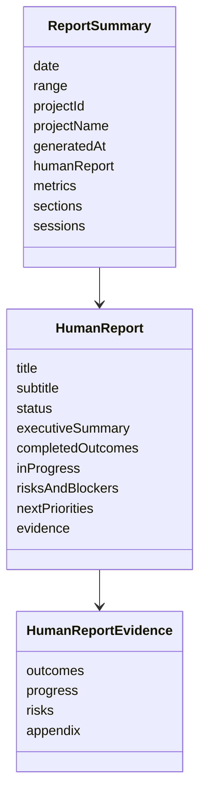
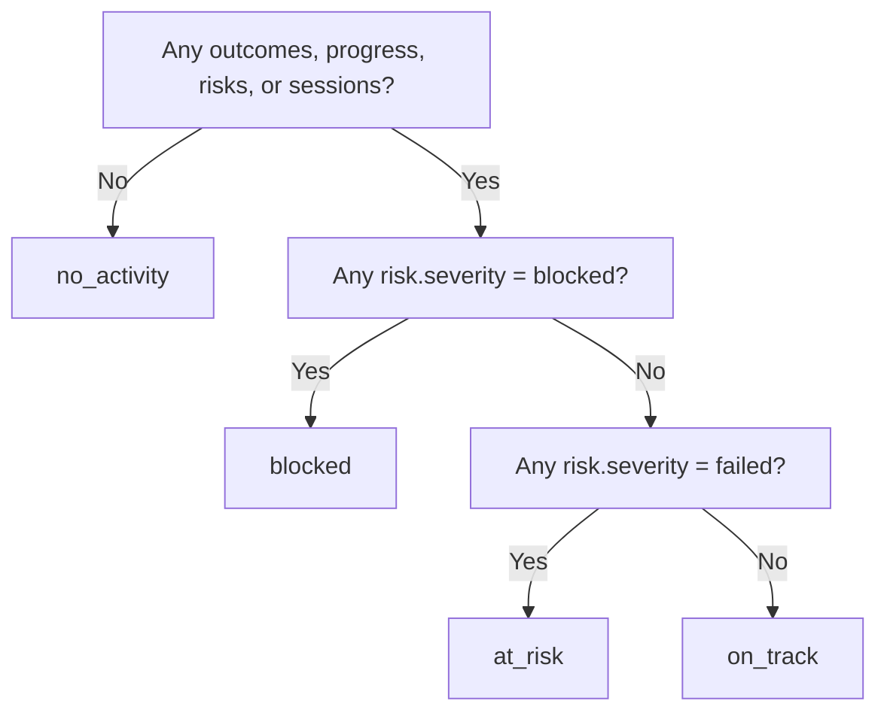
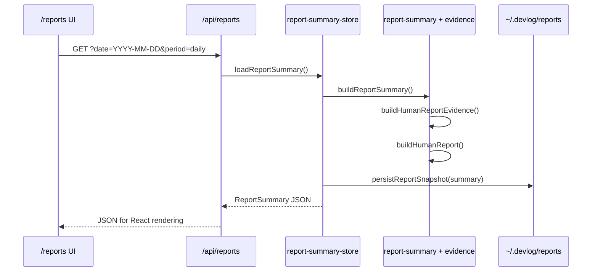
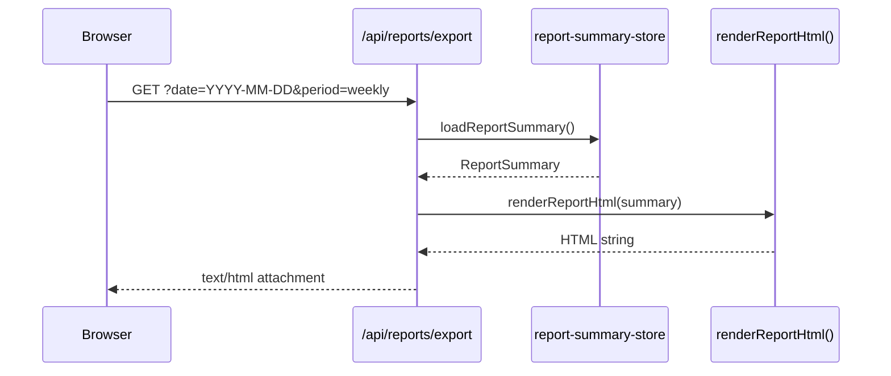
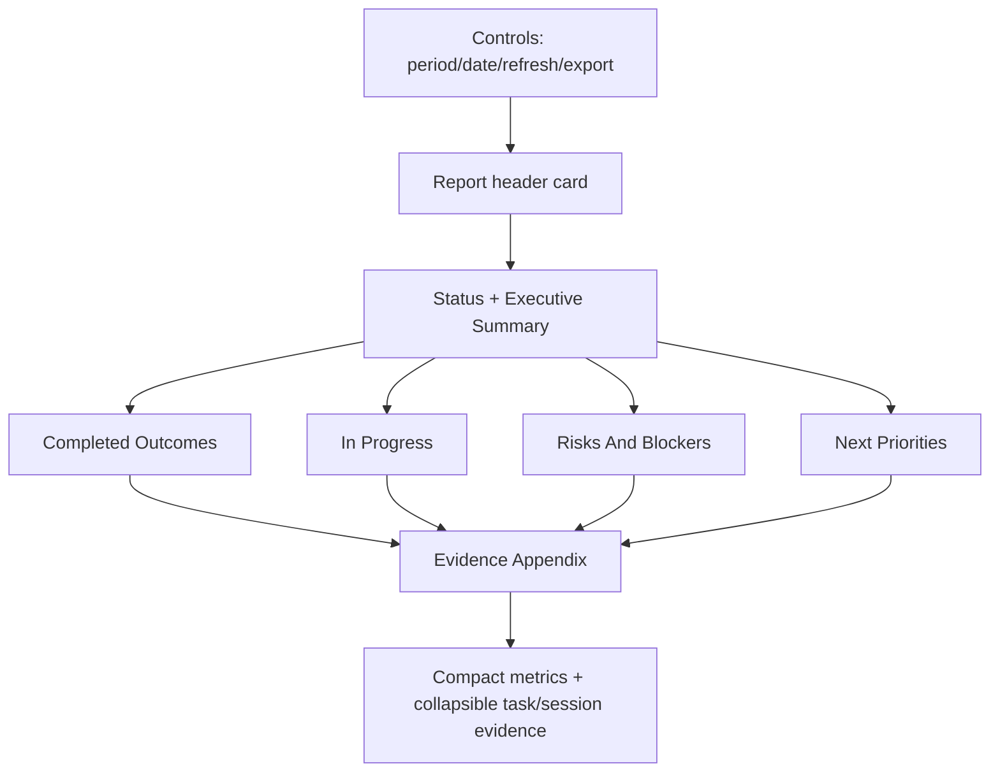

# Human Report Skill Implementation Guide

这份文档给维护 DevLog Reports 的人读。`SKILL.md` 是 agent 触发和行为约束；本文件说明当前代码如何把 tasks/sessions 转成可读的项目日报/周报，以及改动时应该从哪里下手。

> 注意：这里的 Markdown 只是维护文档。产品 v1 仍然不提供 Markdown 输出；用户可见导出格式只有 HTML。

## 目标

Human Report 的目标不是展示原始日志，而是把 DevLog 里的任务和 session 证据整理成项目负责人能直接阅读、复制或导出的状态报告：

- 项目状态：`On Track` / `At Risk` / `Blocked` / `No Activity`
- 本周期完成了什么
- 哪些工作仍在推进
- 哪些风险、阻塞或失败需要处理
- 下一步优先级
- 支撑以上结论的简洁证据附录

## 主要文件

| 文件 | 职责 |
| --- | --- |
| `docs/skills/human-report/SKILL.md` | repo-local skill 触发说明，约束 Reports 必须是 human-facing status report。 |
| `src/core/report-skill.ts` | 运行时 skill contract：章节、清洗规则、输出格式质量门。 |
| `src/core/report-evidence.ts` | 把 period 内的 raw tasks/sessions 清洗成 outcomes、progress、risks、appendix。 |
| `src/core/report-summary.ts` | 构建 `ReportSummary`、`humanReport`、HTML export。 |
| `src/core/report-summary-store.ts` | 从 SQLite 加载数据，构建 summary，并把 backend JSON snapshot 写入 reports 目录。 |
| `src/app/api/reports/route.ts` | 给 React 页面返回 JSON 应用数据。 |
| `src/app/api/reports/export/route.ts` | 只返回 HTML export。 |
| `src/app/reports/page.tsx` | 把 `humanReport` 作为首屏主体，metrics/raw evidence 放到 appendix。 |

## 总体流程



关键约束：

1. JSON 是应用数据和 backend snapshot，不是用户导出格式。
2. HTML 是用户可见导出格式。
3. Metrics 只能支持报告叙事，不能重新占据主体。
4. Session prompt/runtime/detail 默认进入 evidence appendix。

## 数据清洗逻辑

`buildHumanReportEvidence()` 是 deterministic v1 的核心清洗层。它只处理传入的 rows，不访问数据库，不依赖 React，也不调用 LLM。



### Evidence Promotion Matrix

| Source | Condition | Human report destination | Why |
| --- | --- | --- | --- |
| Task | `status === "done"` and touched in range | `completedOutcomes` | Finished work is the strongest human-readable outcome. |
| Task | `todo`, `in_queue`, `in_progress`, `review` and touched in range | `inProgress` | Shows work that moved or still needs follow-through. |
| Task | `blocked`, `fail` and touched in range | `risksAndBlockers` | Needs attention before project can be considered healthy. |
| Session | `status === "failed"` and touched in range | `risksAndBlockers` | Runtime failure is a project risk even if no task is blocked yet. |
| Task/session | Any period-relevant row | `evidence.appendix` | Keeps audit detail available without making it the report body. |

## Human Report Model

`ReportSummary` keeps older dashboard-compatible fields, but the new primary view model is `humanReport`.



### Status Decision Tree

`buildHumanReportStatus()` uses a simple priority order. This is intentional: failure/blocking evidence must win over generic progress metrics.



当前状态含义：

| Status | Label | When |
| --- | --- | --- |
| `no_activity` | No Activity | 周期内没有 task/session 证据。 |
| `blocked` | Blocked | 存在 blocked task。 |
| `at_risk` | At Risk | 存在 failed task/session，但没有 blocked task。 |
| `on_track` | On Track | 有活动且没有风险/阻塞。 |

## Request/Response Sequence



HTML export 走同一个 summary 构建路径：



## Output Surfaces

| Surface | Format | Audience | Rule |
| --- | --- | --- | --- |
| `/reports` | React-rendered app JSON | Human reader | `humanReport` sections first, evidence appendix after narrative. |
| `/api/reports` | JSON | Internal app/API automation | Keeps structured `humanReport`, metrics, and evidence. |
| `/api/reports/export` | HTML | Human reader | Only user-facing export format in v1. |
| `~/.devlog/reports/*.json` | JSON snapshot | Backend audit/regeneration | Best-effort persistence; write failure must not break rendering. |

## Implementation Notes

### `report-skill.ts`

The runtime contract makes the skill visible to code instead of only to docs:

- `sections`: canonical report section order.
- `cleaningRules`: explicit rules for what gets promoted vs. appendix-only.
- `qualityGate`: confirms frontend output is HTML, backend artifact is JSON, Markdown output is disabled.

This module should stay deterministic. Do not add LLM summarization here until deterministic reports are stable.

### `report-evidence.ts`

This module is pure and testable. Keep it that way:

- Inputs are `ReportRange`, `ReportTask[]`, `ReportSession[]`.
- Outputs are `HumanReportEvidence`.
- It should not know about Next.js, HTTP, SQLite, files, or UI.
- If a future cleaner needs richer session logs, add explicit input fields rather than reading global state.

### `report-summary.ts`

This is the composition layer:

1. Normalize/build period range.
2. Compute legacy metrics and sections for compatibility.
3. Build cleaned evidence.
4. Build `humanReport`.
5. Render HTML export from `humanReport` first, then appendix.

Keep `ReportSummary.metrics`, `sections`, and `sessions` available until consumers are migrated; do not remove them just because the UI no longer leads with them.

### `report-summary-store.ts`

Store responsibilities:

- Query tasks/sessions.
- Resolve project names safely via `Map`.
- Build summary.
- Persist backend snapshot with `getReportSnapshotFileName()`.

Snapshot write is best-effort. If the disk write fails, the page/export should still render unless the input itself is invalid.

## Visual Layout Contract

The `/reports` screen should read top-to-bottom like this:



Do not reintroduce metric cards above the executive summary. Metrics belong in `Evidence Appendix` unless the product decision changes.

## Tests And Verification

Run focused tests when changing the report pipeline:

```bash
node --test --import tsx \
  src/core/__tests__/report-skill.test.ts \
  src/core/__tests__/report-evidence.test.ts \
  src/core/__tests__/report-summary.test.ts \
  src/core/__tests__/report-summary-store.test.ts
```

Run full verification before shipping:

```bash
bun run test
bun run typecheck
bun run build
```

Manual checks:

```bash
curl -i "http://localhost:3333/api/reports?period=daily&date=2026-05-28"
curl -i "http://localhost:3333/api/reports/export?period=daily&date=2026-05-28"
```

Browser checks:

- Open `http://localhost:3333/reports`.
- First report content is status + executive summary, not metric cards.
- `Export HTML` downloads an `.html` file.
- No visible JSON or Markdown export control is present.
- `Evidence Appendix` is below the human report sections.

## Safe Future Extensions

1. Add richer deterministic wording in `buildExecutiveSummary()`.
2. Add optional LLM polish after deterministic evidence is stable and snapshot-backed.
3. Add project-specific report filters, preserving HTML as the user-facing export.
4. Add more appendix evidence, but keep it collapsible or secondary.

Avoid:

- Cost analytics inside human project reports.
- Raw session timelines as the default report body.
- Markdown or JSON as visible user export buttons.
- LLM-only summaries without deterministic evidence and tests.
